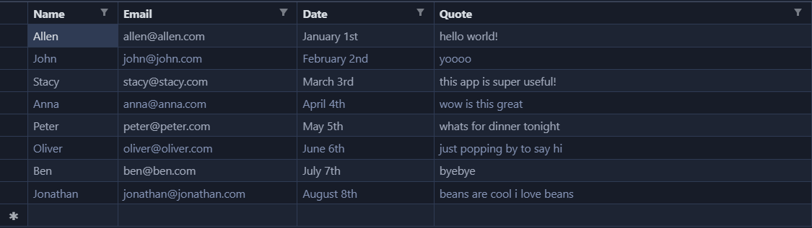

# mailer
Tool that sends custom emails to the masses

## Structure

```    
    .
    ├── config.txt              template for constants
    ├── constants.py            constants including email body
    ├── data.csv                data for each email
    ├── mailer.py               script entry point
    ├── README.md               this document
    ├── requirements.txt        python pkg requirements
    └── ...

```

## Setup

1. To setup the application, you will need python 3, pip, and virtualenv. You can run the application without pip or virtualenv if pandas is already installed.

### If using Mac OS / Linux
```
virtualenv env
source env/bin/activate
pip install -r requirements.txt
```

### If using Windows
```
virtualenv env
env\Scripts\activate
pip install -r requirements.txt
```
2. Next create a data.csv file like the one shown below, and make sure that data.csv is filled out. Currently it contains a sample of what such a csv can look like. The first row of the csv should contain the column names that will be substituted in the body and subject line of the emails. Make sure that one of the columns is called "email" as it is required.


3. Make a constants.py file with the appropriate email and subject line like how the template currently does it using an f-string. Note that formatting and line breaks here show up in the actual email.

4. Visit https://myaccount.google.com/u/3/lesssecureapps using the account you intend to send emails with and allow less secure apps. This change allows local applications that are running from your personal computer to gain access to your gmail account, kind of like when you log in with google on external sites.

## Usage

To run simply run one of the commands

- ```python mailer.py -s``` prints 3 sample emails that will be sent to the console
- ```python mailer.py -t``` sends 3 test emails to your email address
- ```python mailer.py``` sends emails to all recepients